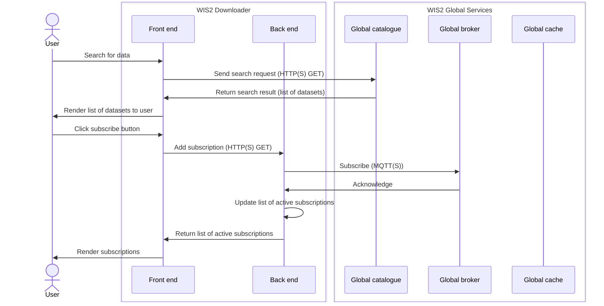
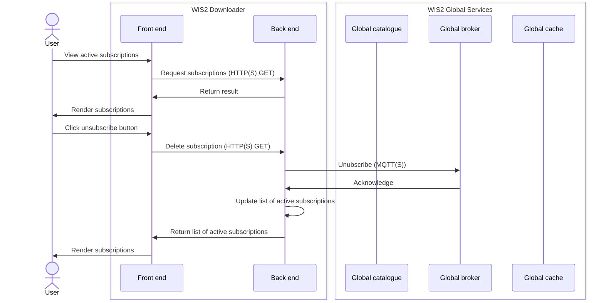
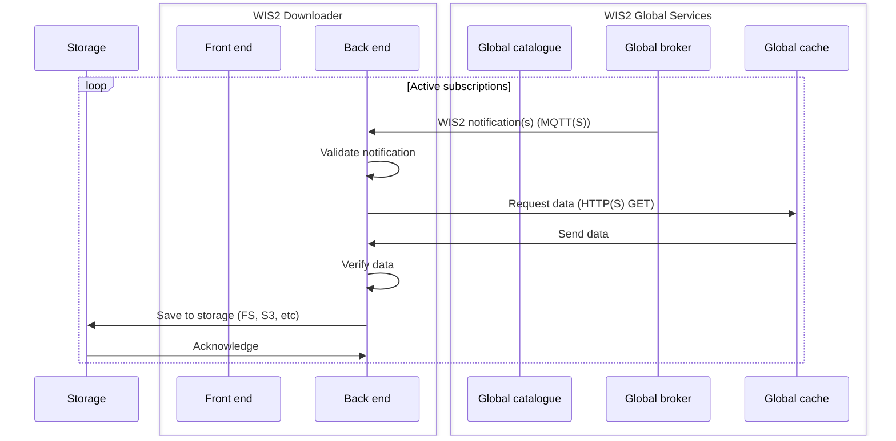

# wis2-downloader-backend

## How to Create a Frozen Backend for Windows

Install dependencies

``
pip install -r requirements.txt
``

Activate virtual environment

``
python -m venv venv
``

Then run

``
pyinstaller -F --paths=D:\env\Lib\site-packages subscribe-backend.py
``

This will create the executable ready to be used with a configuration file.

## How to Create a Frozen Backend for Linux

Pyinstaller does not allow for cross-compiling (that is, compiling for an OS different to that which is used). To ensure the backend is compatible with Ubuntu, I've found the best approach is to compile the backend script in a WSL (Windows Subsystem for Linux) environment, which can be downloaded from the [Microsoft Store](https://apps.microsoft.com/detail/9pn20msr04dw?hl=en-US&gl=US). This is convenient because the Electron app will also need to be made in this environment. 

## How to Create a Frozen Backend for MacOS

This should be done on a genuine Macbook, following the steps for Windows described above.

## How to Use the Frozen subscribe backend
### The Configuration File
To use the backend executable standalone, a configuration file must be made. This is a JSON file with three keys:

- `broker`: The URL of the global broker to be used in the subscription.
- `topics`: A list of the topics to subscribe to.
- `download_directory`: The directory where the latest data should be downloaded to.

Note:
- The entries in this JSON file should be strings.
- The download directory should be specified with forward slashes `/`.

### Launching the Executable
Now the configuration file has been made, the executable can be run using

``
./subscribe-backend.exe --config {MY_CONFIG_FILE}
``

There is one argument for this executable:
- `--config` (optional): The relative directory of the configuration file. By default, this is 'config.json' located in the same directory as the executable.

Once the executable is launched, it will continuously download the latest notifications from the specified topics. It will continue running until manually terminated or the computer is fully powered off.

## Managing Topics of an On-Going Subscription

To add, delete, or list subscriptions, we can make use of the Flask app created by the executable. That is, we can make an API call (HTTP GET) to do this.

### Add Topic to Subscription
For example, to add topic: `cache/a/wis2/+/+/data/core/weather/surface-based-observations/#`, we run

``
curl http://localhost:5000/wis2/subscriptions/add?topic=cache/a/wis2/%2B/%2B/data/core/weather/surface-based-observations/%23
``

### Delete Topic from Subscription
For example, to delete topic: `cache/a/wis2/+/+/data/core/weather/surface-based-observations/#`, we run

``
curl http://localhost:5000/wis2/subscriptions/delete?topic=cache/a/wis2/%2B/%2B/data/core/weather/surface-based-observations/%23
``

### List Topics Currently Subscribed To
This is done by running

``
curl http://localhost:5000/wis2/subscriptions/list
``

### Notes

- Special symbols (e.g. +, #) in topics need to be URL encoded, + = %2B, # = %23.
- Initial subscriptions can be stored in subscriptions.json
- All data downloaded to ./downloads. This will be updated in future to allow configuration. 
- 2 child threads created, one to download the data and another for the subscriber
- The main program/thread is the flask Front end that manages the subscriptions and downloads

## Workflow

### Search and Subscribe

### Unsubscribe

### Download

